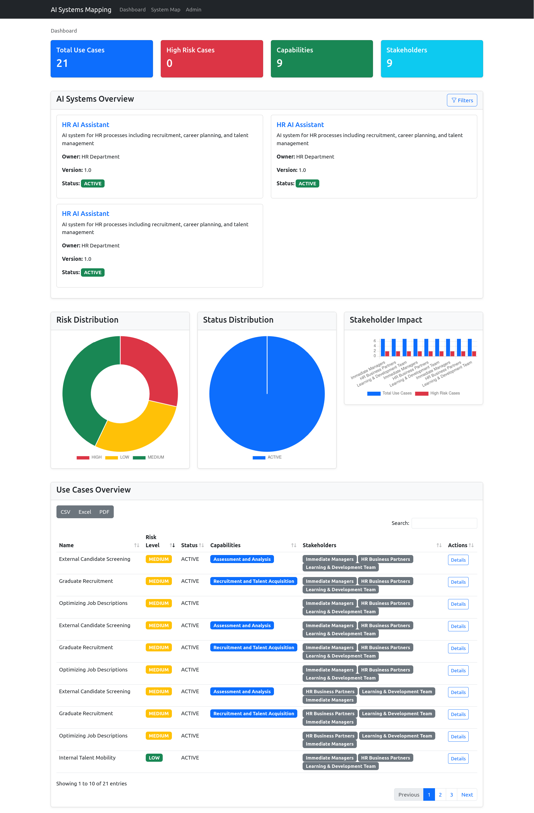
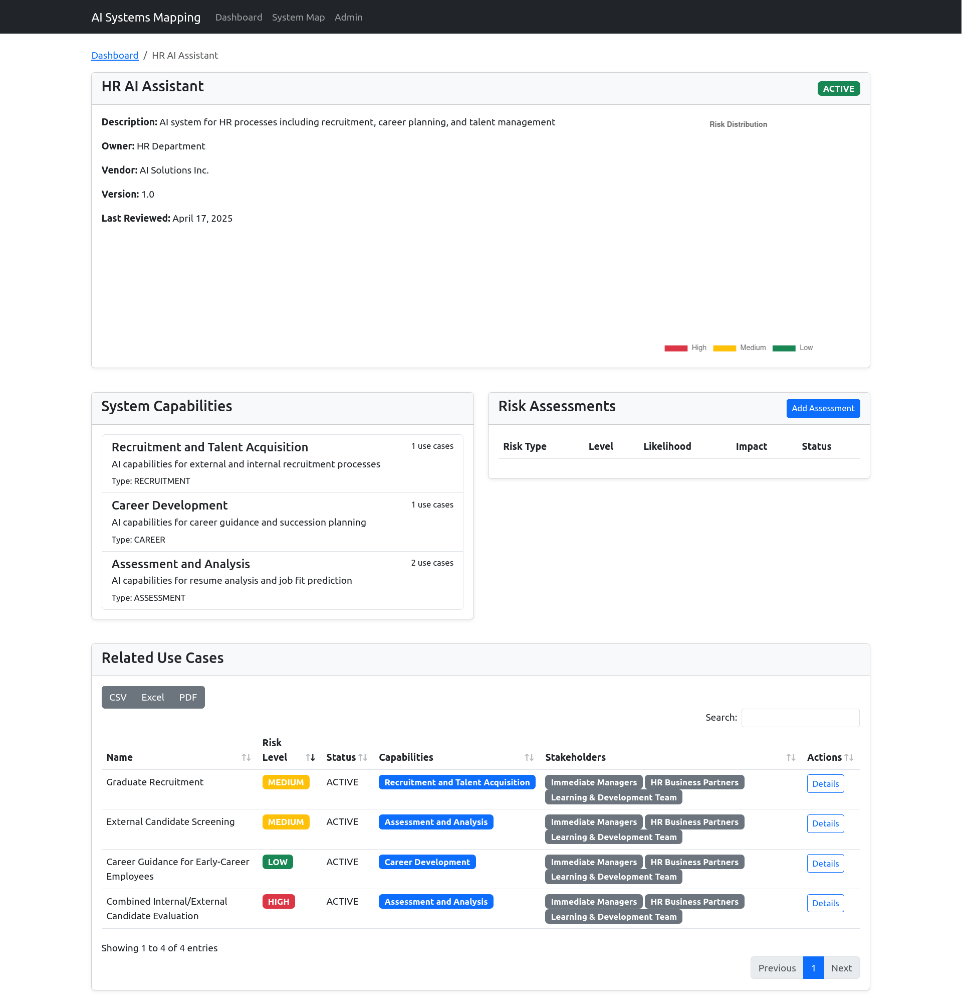

# AI Management System (AIMS) Web Application

This project is a Django-based web application for managing AI systems in accordance with ISO 42001:2023 and ISO/IEC 23894. It features:

- System, Capability, Use Case, User, Stakeholder, Model Card, and AI Risk Assessment management
- Modern, responsive UI (Bootstrap)
- Extensible and maintainable codebase

## Getting Started

1. Create and activate a Python virtual environment:
   ```bash
   python3 -m venv venv
   source venv/bin/activate
   ```
2. Install dependencies:
   ```bash
   pip install -r requirements.txt
   ```
3. Run migrations:
   ```bash
   python manage.py migrate
   ```
4. Start the development server:
   ```bash
   python manage.py runserver
   ```

5. Load initial data (optional):
   ```bash
   python manage.py loaddata initial_data.json
   ```

## Project Structure
- `src/aims/` – Django project settings
- `src/core/` – Main app for AIMS models and logic

## Screenshots

### Main Dashboard


### System Card View


## Sources
- [Django](https://www.djangoproject.com/) – Web framework
- [Bootstrap](https://getbootstrap.com/) – Frontend framework
- [ISO 42001:2023](https://www.iso.org/standard/82084.html) – AI management system standard
- [ISO/IEC 23894](https://www.iso.org/standard/82085.html) – AI risk management standard
- [ISO 31000](https://www.iso.org/iso-31000-risk-management.html) – Risk management standard
- [ISO 27001](https://www.iso.org/isoiec-27001-information-security.html) – Information security management standard
- [James Kavanagh](https://www.linkedin.com/in/jameskavanagh/) – Author and AI governance expert

## Roadmap

### OWASP Top 10 LLM Vulnerabilities
- Integrate controls to address vulnerabilities specific to large language models (LLMs), such as:
  - Injections and prompt manipulation
  - Data leakage prevention
  - Model poisoning and adversarial attacks
  - Secure API integrations

### ISO 42001 Controls
- Expand the implementation of ISO 42001:2023 controls, including:
  - Enhanced risk assessment frameworks
  - Continuous monitoring and auditing mechanisms
  - Improved stakeholder engagement processes
  - Comprehensive compliance tracking and reporting tools

## License
AGLPv3
